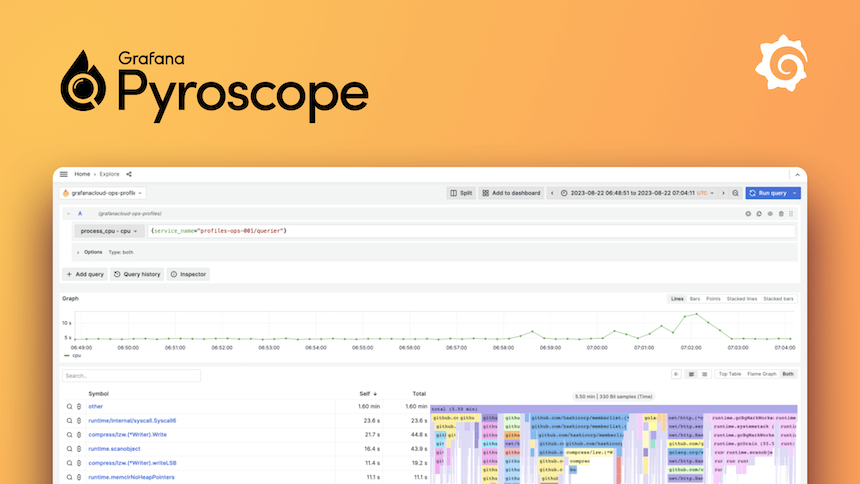

# Pyroscope
  

 
Grafana Pyroscope is an open-source continuous profiling backend that collects, stores, and queries profiling data from your applications. It reveals resource usage - CPU, memory, and more - down to the line of code, making it easy to pinpoint performance bottlenecks and reduce cost. Integrated with Grafana alongside Prometheus, Loki, and Tempo, it adds profiles as a fourth pillar of observability, letting you correlate them with metrics, logs, and traces.
 
 

# / Deployments

 

| Deployment           | Location  | Tags                        | Status       | Url                                                              |
| -------------------- | --------- | --------------------------- | ------------ | ---------------------------------------------------------------- |
| pyroscope-dev-1-vm-1 | dev-1-vm  |  | **inactive** | https://pyroscope.margusm.dev/ http://192.168.40.111:4040  |

# References
-   [Github mirror](https://github.com/margusmuru/homelab-pyroscope)
-   https://grafana.com/oss/pyroscope/
-   [Docs](https://grafana.com/docs/pyroscope/latest/)
